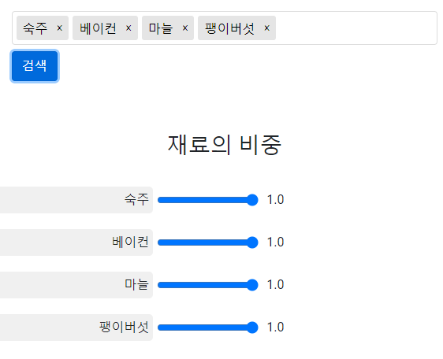
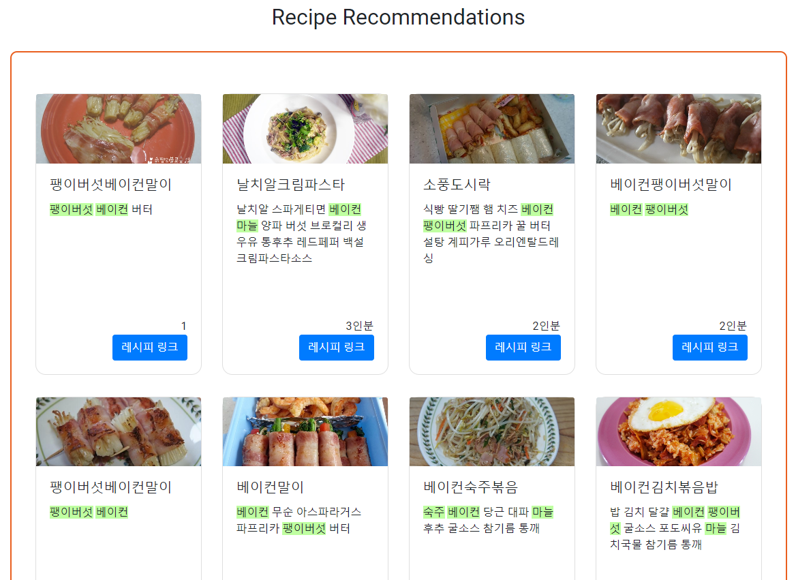
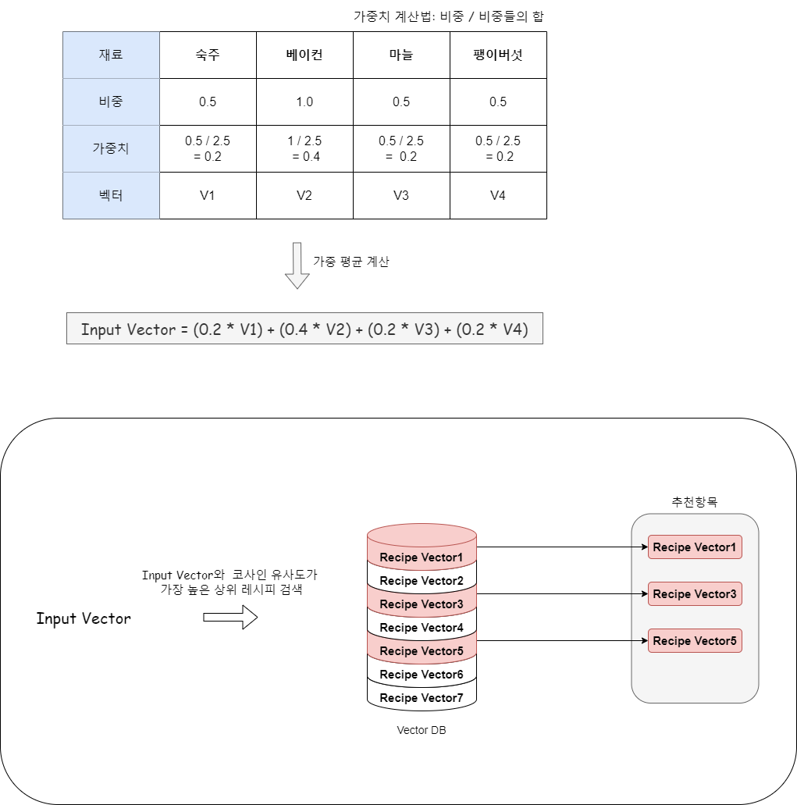
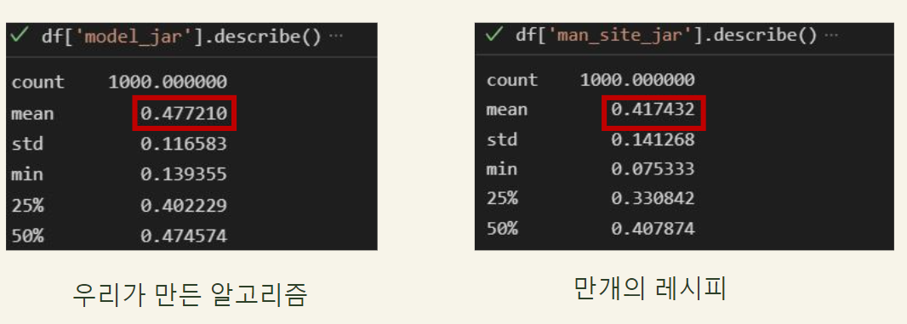
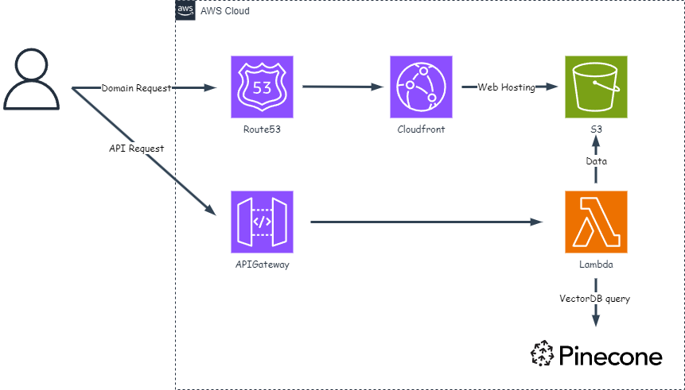

## :book:프로젝트 소개

재료를 입력하면 자연어 처리 기술을 활용하여 레시피를 추천하는 사이트입니다.

자연어 처리 기술을 통해 여러 텍스트에 대해서 유연한 처리를 기대하며 제작을 하였습니다.

> :link:https://www.testrecipe.link/

---

## 🛠️기술

> 백엔드

Python, Numpy, Pandas, Gensim, Openai, Django

> 프론트엔드

Html, CSS, Javascript

> 협업 툴

Github, Notion

> 데이터베이스

Sqlite3, ChromaDB, Pinecone, S3

 

> 배포

AWS Lambda, APIGateway

---

### :timer_clock:개발 내역

> 프로젝트 제작(2022.04 ~ 2022.06)

- 구성원:  백엔드(2명), 프론트엔드(1명), 기획 발표(1명)
- 담당: 데이터 전처리, 추천로직 작성

> 수정사항 - 1(2024.02)

- 임베딩모델 변경: 직접 학습한 Word-to-Vector에서 OpenAI의 text-embedding-3-small로 변경.

>  수정사항 - 2(2024.03 ~ 2024.04)

- 벡터데이터베이스 탐색 방식을 개선하여 로컬환경에서 요청-응답 시간을 1초 -> 0.1초로 개선(https://kokoko12334.tistory.com/entry/hsfl)

> 수정사항 - 3(2024.06 ~ 2024.07)

- 서버리스로 전환하여 비용 절감.

> 수정사항 - 4(2024.08)

- AWS Step Functions를 활용한 ETL 파이프라인을 통해 **"만개의 레시피"에 올라온 최신 레시피 데이터**를 Vector DB에 저장.(https://kokoko12334.tistory.com/120)

---

## :file_folder: 주요 폴더/파일

1. `mysite/chroma`: 레시피 임베딩 벡터 저장공간
2. `mysite/recipe`: 레시피 추천로직 관련
3. `mysite/tests`: 유닛 테스트
4. `lambda_function.py`: 서버리스 환경에서 실행되는 AWS람다함수

---

## :hand: 사용예시

1. 재료를 입력합니다. 재료의 비중을 설정 할 수 있습니다. 비중은 0.5~1 사이이며 1에 가까울 수록 해당 재료가 포함된 레시피를 추천할 가능성이 높아집니다.

2. 결과창 예시입니다.

추천 과정은 다음과 같습니다.

1. **재료 벡터화**: 입력된 재료들을 벡터 형식으로 변환합니다.
2. **비중도 가중평균 계산**: 각 재료의 중요도(비중도)를 반영하여 가중평균을 계산합니다.
3. **코사인 유사도 계산**: 벡터DB에 있는 레시피와 위에서 구한 벡터 사이의 코사인 유사도를 계산합니다.
4. **상위 20개 레시피 추천**: 코사인 유사도가 가장 높은 상위 20개의 레시피를 추천합니다. 

---

## :straight_ruler: 기존 방식과의 비교

### 1. 테스트 케이스

- **데이터 생성**: 872개의 재료에서 재료 간 연관성을 고려하여 중복을 제외한 1,000개의 데이터를 랜덤으로 생성합니다.
- 평가지표: 자카드 유사도
  - **이유**: 입력 데이터와 가장 유사한 출력 데이터를 비교하기 위함입니다.
  - 예시:
    - 입력 데이터: `a, b, c`
    - 출력 데이터: `a, b, c`
    - 자카드 유사도: 1 (가장 높은 유사도)

### 2. 테스트 결과

- 기존 알고리즘 대비 성능 **6% 향상** (기존 만개의 레시피 기반 알고리즘과 비교).

---

## 🖥️ 배포 환경 아키텍처

https://simpleicons.org/

https://emoji.muan.co/
