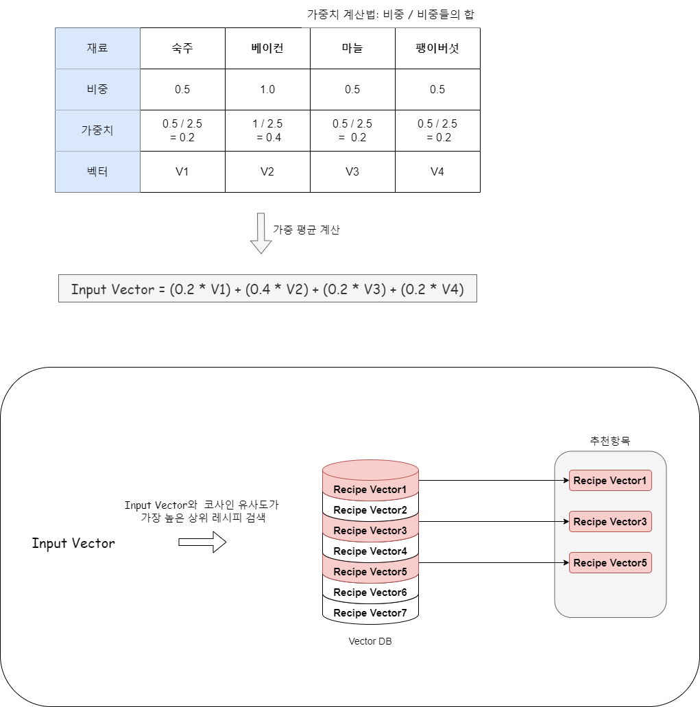

# 파일/폴더 내용

(https://www.testrecipe.link/)

1. `mysite/chroma`: 레시피 임베딩 벡터 저장공간
2. `mysite/recipe`: 레시피 관련 폴더
3. `mysite/tests`: 유닛 테스트
4. `lambda_function.py`: 서버리스 환경에서 실행되는 AWS람다함수

---

재료를 입력합니다. 이때 재료의 비중을 설정 할 수 있습니다. 비중은 0.5~1 사이이며

1에 가까울 수록 해당 재료가 포함된 레시피를 추천할 가능성이 높아집니다.

 

 

추천 과정은 다음과 같습니다.

1. **재료 벡터화**: 입력된 재료들을 벡터 형식으로 변환합니다.
2. **비중도 가중평균 계산**: 각 재료의 중요도(비중도)를 반영하여 가중평균을 계산합니다.
3. **코사인 유사도 계산**: 벡터DB에 있는 레시피와 위에서 구한 벡터 사이의 코사인 유사도를 계산합니다.
4. **상위 20개 레시피 추천**: 코사인 유사도가 가장 높은 상위 20개의 레시피를 추천합니다. 

